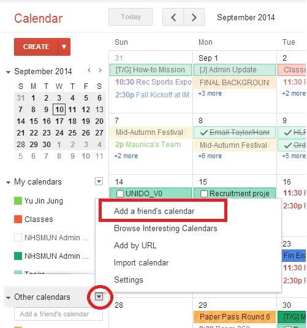

+++
categories = ["general"]
date = "2016-08-24T15:35:56-04:00"
tags = ["document"]
title = "Add Our Calendar"

+++

## To add the UMFC calendar to Google Calendar:
1. Visit <a target="_blank" href="https://calendar.googe.com">Google Calendar</a>.
2. Click on the arrow next to "Other Calendars."
3. Select "Add a friend's calendar."
4. Paste in <pre>umich.edu_toeb19ptci3123vprh6464i308@group.calendar.google.com</pre>
5. Click "Add."

